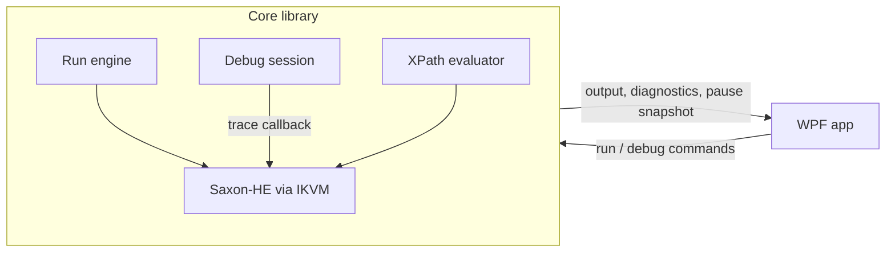

# XSLT editor and debugger (XmlSpy-like)

## Conversation Evidence

> user (turn 1): "Jeg vil gerne have et program lignende XmlSpy til at køre og redigere XSLT og debugge i det. Læg en plan. Saxon kan meget."
> user (turn 2, selected): "Saxon-HE via IKVM (Recommended)"
> user (turn 2, selected): "WPF (Recommended)"
> user (turn 2, selected): "XPath-evaluator"
> user (turn 2, selected): "HTML-preview"
> user (turn 3): "spørg  mig om de ting du har inferred."
> user (turn 4, selected): ".NET 10 + AvalonEdit"
> user (turn 4): "output af xslt er xml."
> user (turn 4, selected): "R5 Breakpoints"
> user (turn 4, selected): "R8 Variabler"
> user (turn 4, selected): "Ingen af dem"
> user (turn 5, selected): "Output vises som XML, ingen HTML-preview"
> user (turn 5, selected): "Behold R4, fjern R3"
> user (turn 5, selected): "Behold R6 helt"
> user (turn 5, selected): "include/import"
> user (turn 5, selected): "Stop uendelig løkke"
> user (turn 5, selected): "Responsiv UI"
> user (turn 5, selected): "Testbar kerne"
> user (turn 6, selected): "Ja, markør til linjen"
> user (turn 7): "Det går an på hvad du mener med anden fil. Anden XSLT? Så skal den kræve man gemmer. Anden XML? Så skal den kræve man gemmer HVIS der er rettet i den. Output behøver man ikke gemme."
> user (turn 8): "Den skal ikke skifte til at vise moms.xsl."
> user (turn 8, selected): "Faner i XSLT-ruden (Recommended)"
> user (turn 9): "Vi er enige i at programmet ikke ligner det design du viste mig? Det skal den."
> user (turn 9, selected): "Kun lyst"
> user (turn 9, selected): "Alle seks menuer"
> user (turn 10): "Og, nu skal du så sørge for at det er en single exe file publish (du kan se hamster-pet eller hoboman for inspiration) og at der ligger en ps1 install."
> user (turn 10): "Og at der er en detaljeret og godt beskrevet README fil med billeder."
> user (turn 10): "\"globale variabler mangler i variabelpanelet\": Hvorfor? tilføj dem hvis muligt?"
> user (turn 11): "Du har sikkert hardcoded alle tekster i kildekoden. Det skal det ikke være. Alle danske tekster skal komme fra en sprogfil, hvor dansk og engelsk er mulige valg."
> user (turn 12): "1) Der skal ikon på, ligesom hoboman. 2) CTRL + S skal gemme den fil man står markeret på. XML eller XSLT."
> user (turn 12): "En almindelig Kør kan ikke stoppes ... Hvorfor kan den ikke stoppes? Uendelig løkke skal IKKE bare fortsætte ? jeg skal sgu da ikke stoppe programmet ?"
> user (turn 12): "Jeg skal kunne klikke "STOP" altså [] ikon."
> user (turn 13): "Beskeder ved stop: Det skal være løbende! Det skal variable vel også og output?"
> user (turn 13, selected): "Løbende, behold ved Stop/fejl"
> user (turn 14): "Hvorfor sendes det ikke så snart der kommer noget, og så synkroniseres ud i UI hver 100 ms... når man så stopper eller pauser tager man lige det sidste fra pipelinen?"
> user (turn 13): "Extra proces: Så længe der kun kører én UI."
> user (turn 11): "Og så skal den linje debuggeren stopper på gerne markeres med orange baggrundsfarve, så man visuelt også kan se hvis man begynder at kalde next, step in, out, over etc."

## Goal & Context

<!-- Source: 40% user / 55% [paraphrase] / 5% [inferred] -->

A desktop program similar to XmlSpy for running, editing and debugging XSLT, built on Saxon. The user wants one tool where an XSLT stylesheet can be written, run against XML input, and stepped through when the result is wrong. The transformation output is XML. Beyond the core, the user chose an XPath evaluator.

## Architecture & Data Models

<!-- Source: 30% user / 40% [paraphrase] / 30% [inferred] -->

- Transformation engine: Saxon-HE via IKVM.
- Runtime: .NET 10. [paraphrase]
- UI: WPF.
- Text editor: AvalonEdit (syntax highlighting, folding, breakpoint margin). [paraphrase]
- The Saxon wrapper and debug engine live in a UI-free core library so they can be tested without WPF; the WPF app only presents state and sends commands. [paraphrase]
- Debugging uses Saxon's trace hooks: the stylesheet is compiled with tracing enabled, the transformation runs on a background thread, and the trace callback for each instruction checks breakpoints/step mode and blocks the thread until the UI sends a continue/step/stop command. [inferred]
- Session state while paused: current instruction location (stylesheet URI + line) and in-scope variables/params. Owned by the debug session; the UI reads a snapshot. [inferred]
- Locations (breakpoints, diagnostics, pause position) are compared by one normalized file key (absolute path, case-insensitive), so Saxon's `file:///` system ids and editor paths match.



## Edge Cases & Constraints

- Saxon-HE has no streaming and no schema awareness; both are out of reach without a commercial edition. [inferred]
- The UI stays responsive while Saxon/IKVM starts up (the first call through IKVM has a noticeable startup cost). [paraphrase]
- Stylesheets using `xsl:include` / `xsl:import`: breakpoints and error locations resolve to the correct included file, not only the main stylesheet. [paraphrase]
- A run that never terminates can be stopped from the UI without closing the program. [paraphrase] This holds for Run and Debug alike, including a loop inside a single XPath expression (R22).
- Run and Debug use the files on disk: dirty documents are saved first, and an unsaved (untitled) stylesheet cannot be run.
- One run or debug session at a time; Run/Debug are disabled while a session is active, and editors are read-only during a debug session.
- Output written before a failure or Stop stays in the output pane, and the status says the run failed or was stopped (R24). Stop first asks the worker to send what it still holds and end itself; only a worker that has not ended shortly after is killed, so nothing written before Stop is lost.
- Closing the program during a paused or running session stops it; the process does not hang.
- The XSLT pane has tabs. The first tab holds the XSLT file that Run and Debug execute, and navigation never replaces it. A diagnostic or a debug pause in an included/imported file opens that file in an extra tab, or switches to its tab when already open. [paraphrase]
- A modified XSLT or XML document must be saved before another file is opened in its place (save or cancel; no discard). The output pane never asks to save. [paraphrase]

## Acceptance Criteria

- **R1:** XML and XSLT files can be opened, edited and saved in an editor with XML syntax highlighting. Errors: missing or unreadable file → message, editor content unchanged; malformed XML stays editable (no blocking). [paraphrase]
- **R2:** The user can run the XSLT against the XML input and see the result in an output pane. Errors: compile or runtime failure → never shown as success: the status says it failed and the failure is reported per R4; output written before a runtime failure stays (R24). [paraphrase]
- **R4:** Compile errors, runtime errors and `xsl:message` output are listed with file and line; selecting an entry moves the editor cursor to that location. Errors: an entry without location is listed but not navigable. [paraphrase]
- **R5:** The user can set breakpoints on XSLT lines (including in included/imported stylesheets); a debug run pauses before executing an instruction on such a line. Errors: a breakpoint on a line with no instruction is never hit and is shown as unbound. [paraphrase]
- **R6:** While debugging, the user can step into, step over, step out, continue and stop. Errors: stop during a running or paused transformation ends the run and leaves the program responsive. [paraphrase]
- **R8:** While paused, in-scope variables and parameters are shown with their values. Errors: a value that cannot be inspected is shown as unavailable; the debug session continues. [paraphrase]
- **R9:** The user can evaluate an XPath expression against the input XML and see the result. Errors: invalid XPath or missing input → error message, no crash. [paraphrase]
- **R11:** The output pane shows the transformation result as XML with XML syntax highlighting. Errors: output that is not well-formed XML is shown as plain text, no crash. [paraphrase]
- **R12:** When a debug run pauses (breakpoint or step), the editor opens the file holding the paused instruction, including an included/imported stylesheet, and moves the caret to the paused line. Errors: no location for the paused instruction → caret unchanged, session continues. [paraphrase]
- **R13:** The main window looks like the approved mockup (`docs/design/main-window-mockup.html`), light theme only: title bar with brand mark, six menus (Filer, Rediger, Vis, Kør, Debug, Hjælp) holding the app's existing commands (a menu with no existing command stays empty) and the run file's path; toolbar with icon buttons, labeled Kør and Debug, debug step buttons and a pause badge naming file and line while paused; XPath bar below the toolbar; the three panes (XML input, XSLT, Output) as bordered cards with a type badge, file name and meta text in the header; draggable splitters between the panes and above the bottom panel; bottom panel with the tabs Variabler and Fejl og beskeder; status bar with engine (Saxon-HE 12 · XSLT 3.0), session state, caret position, encoding and line endings; the mockup's light colors, syntax colors and spacing, with Segoe UI as UI font and Cascadia Mono as code font. Errors: no error surface beyond R1-R12. [paraphrase]
- **R14:** While paused, global variables and stylesheet parameters are shown in the Variabler panel together with the local ones, and each row shows its scope (Lokal or Global). Errors: a global that has not been evaluated yet or cannot be inspected is shown as unavailable; the debug session continues. [paraphrase]
- **R15:** The app is published as one exe file (single-file publish with the same publish settings as the user's Hoboman app) that starts and can run, debug and evaluate XPath without any other files next to it. Errors: no error surface beyond R1-R14. [paraphrase]
- **R16:** `install.ps1` in the repository root publishes the exe to a `publish` folder, waits while a running copy of the app from that folder is open, creates a Start menu shortcut, and starts the app. Errors: a failed publish stops the script with a clear message and leaves no shortcut change. [paraphrase]
- **R17:** `README.md` describes the program in detail in Danish with screenshots: what it does, requirements, install via `install.ps1` and running from source, how to run, debug (breakpoints, stepping, variables), use the XPath evaluator and the error list, the project layout, and build/test commands. Errors: no error surface. [paraphrase]
- **R18:** No user-facing text is hard-coded in the source: every text the user sees (menus, buttons, tooltips, headers, messages, status texts, dialog texts, the program's own diagnostic texts) comes from a language file, and Danish and English are both available. The language is chosen under Vis → Sprog, applies at once without restart, and is remembered between starts; Danish is the default. Language files follow the user's Hoboman app (one embedded JSON file per language, a missing key falls back to Danish). Saxon's own error messages are shown as Saxon writes them. Errors: an unreadable or missing settings file → Danish, no crash. [inferred: menu placement, persistence location, live switch]
- **R19:** While a debug run is paused, the paused line has an orange background in the editor that shows it; the highlight moves with every step (into, over, out) and continue, and disappears when the run stops, completes or fails. Errors: no location for the paused instruction → no highlight, session continues. [paraphrase]
- **R20:** The program has its own icon like the user's Hoboman app: the exe, the window/taskbar and the Start menu shortcut show it, and the README header shows it as an image. The icon uses the brand mark from the approved mockup (</> on the blue rounded square). Errors: no error surface. [paraphrase]
- **R21:** Ctrl+S saves the file of the editor that has focus: the XML input, or the selected XSLT tab. With focus elsewhere it saves the editor that last had focus. An untitled document opens the save dialog. Errors: a failed save shows the existing save error message; nothing else changes. [paraphrase]
- **R22:** The Stop button (■) and Shift+F5 stop any running transformation at once — a plain Run as well as a Debug session, running or paused, including an infinite loop inside a single XPath expression — without closing the program; the program stays responsive and a new Run or Debug can start right after. Errors: a stopped run keeps the output written so far and shows a status saying it was stopped (R24). [paraphrase]
- **R23:** Compile errors, runtime errors and `xsl:message` entries appear in Fejl og beskeder while a Run or Debug session is still running, as Saxon reports them; nothing reported before a Stop, a failure or a pause is lost. Errors: no error surface beyond R4. [paraphrase]
- **R24:** The output pane shows the result while it is being written, during Run and Debug, also while the debugger is paused. On Stop or failure the output written so far stays, and the status says the run was stopped or failed (incomplete output). Whether the final text is highlighted as XML or shown as plain text (R11) is decided when the run ends. Errors: no error surface beyond R2/R11/R22. [paraphrase]

## Early proof point

Task fn-1-xslt-editor-and-debugger-xmlspy-like.1 validates the core approach (Saxon-HE runs through IKVM on .NET 10, and compile-with-tracing delivers per-instruction callbacks with file and line, including included stylesheets, on a thread that can be blocked and resumed). If it fails, re-evaluate the engine choice (Saxon-HE via IKVM) before continuing with fn-1-xslt-editor-and-debugger-xmlspy-like.2+.

## Boundaries

- No commercial Saxon edition (SaxonCS/EE); streaming and schema-aware XSLT are out. [paraphrase]
- Windows only; no cross-platform UI. [paraphrase]
- No HTML preview of the output. [paraphrase]
- No stylesheet parameters UI. [paraphrase]
- Secondary results from `xsl:result-document` are not shown.
- Breakpoints are not persisted across program restarts.
- No dark theme. [paraphrase]

## Decision Context

Saxon-HE via IKVM was chosen over SaxonCS because SaxonCS is only sold as Enterprise Edition with a license, while HE is free (MPL 2.0) and supports XSLT 3.0. The trade-off: IKVM-compiled Saxon is not officially supported by Saxonica on .NET. WPF was chosen over Avalonia; the program targets Windows only. The XPath evaluator was chosen as an addition. HTML preview was first chosen and then dropped because the transformation output is XML. [paraphrase]

The first design stopped only through the trace callback, so a plain Run and a loop inside one XPath expression could not be stopped; the user rejected that limit (R22).

## Quick commands

```bash
dotnet build HoboXslt.slnx
dotnet test tests/HoboXslt.Core.Tests
```

## Requirement coverage

| Req | Description | Task(s) | Gap justification |
| --- | --- | --- | --- |
| R1 | XML and XSLT files can be opened, edited and saved in an editor with XML syntax highlighting. Errors: missing or unreadable file → message, editor content unchanged; malformed XML stays editable (no blocking). | fn-1-xslt-editor-and-debugger-xmlspy-like.3 | — |
| R2 | The user can run the XSLT against the XML input and see the result in an output pane. Errors: compile or runtime failure → never shown as success: the status says it failed and the failure is reported per R4; output written before a runtime failure stays (R24). | fn-1-xslt-editor-and-debugger-xmlspy-like.1, fn-1-xslt-editor-and-debugger-xmlspy-like.15, fn-1-xslt-editor-and-debugger-xmlspy-like.3 | — |
| R4 | Compile errors, runtime errors and `xsl:message` output are listed with file and line; selecting an entry moves the editor cursor to that location. Errors: an entry without location is listed but not navigable. | fn-1-xslt-editor-and-debugger-xmlspy-like.1, fn-1-xslt-editor-and-debugger-xmlspy-like.3 | — |
| R5 | The user can set breakpoints on XSLT lines (including in included/imported stylesheets); a debug run pauses before executing an instruction on such a line. Errors: a breakpoint on a line with no instruction is never hit and is shown as unbound. | fn-1-xslt-editor-and-debugger-xmlspy-like.2, fn-1-xslt-editor-and-debugger-xmlspy-like.5 | — |
| R6 | While debugging, the user can step into, step over, step out, continue and stop. Errors: stop during a running or paused transformation ends the run and leaves the program responsive. | fn-1-xslt-editor-and-debugger-xmlspy-like.2, fn-1-xslt-editor-and-debugger-xmlspy-like.5 | — |
| R8 | While paused, in-scope variables and parameters are shown with their values. Errors: a value that cannot be inspected is shown as unavailable; the debug session continues. | fn-1-xslt-editor-and-debugger-xmlspy-like.2, fn-1-xslt-editor-and-debugger-xmlspy-like.5 | — |
| R9 | The user can evaluate an XPath expression against the input XML and see the result. Errors: invalid XPath or missing input → error message, no crash. | fn-1-xslt-editor-and-debugger-xmlspy-like.4 | — |
| R11 | The output pane shows the transformation result as XML with XML syntax highlighting. Errors: output that is not well-formed XML is shown as plain text, no crash. | fn-1-xslt-editor-and-debugger-xmlspy-like.3 | — |
| R12 | When a debug run pauses (breakpoint or step), the editor opens the file holding the paused instruction, including an included/imported stylesheet, and moves the caret to the paused line. Errors: no location for the paused instruction → caret unchanged, session continues. | fn-1-xslt-editor-and-debugger-xmlspy-like.2, fn-1-xslt-editor-and-debugger-xmlspy-like.5 | — |
| R13 | The main window looks like the approved mockup (`docs/design/main-window-mockup.html`), light theme only: title bar with brand mark, six menus (Filer, Rediger, Vis, Kør, Debug, Hjælp) holding the app's existing commands (a menu with no existing command stays empty) and the run file's path; toolbar with icon buttons, labeled Kør and Debug, debug step buttons and a pause badge naming file and line while paused; XPath bar below the toolbar; the three panes (XML input, XSLT, Output) as bordered cards with a type badge, file name and meta text in the header; draggable splitters between the panes and above the bottom panel; bottom panel with the tabs Variabler and Fejl og beskeder; status bar with engine (Saxon-HE 12 · XSLT 3.0), session state, caret position, encoding and line endings; the mockup's light colors, syntax colors and spacing, with Segoe UI as UI font and Cascadia Mono as code font. Errors: no error surface beyond R1-R12. | fn-1-xslt-editor-and-debugger-xmlspy-like.6 | — |
| R14 | While paused, global variables and stylesheet parameters are shown in the Variabler panel together with the local ones, and each row shows its scope (Lokal or Global). Errors: a global that has not been evaluated yet or cannot be inspected is shown as unavailable; the debug session continues. | fn-1-xslt-editor-and-debugger-xmlspy-like.7 | — |
| R15 | The app is published as one exe file (single-file publish with the same publish settings as the user's Hoboman app) that starts and can run, debug and evaluate XPath without any other files next to it. Errors: no error surface beyond R1-R14. | fn-1-xslt-editor-and-debugger-xmlspy-like.8 | — |
| R16 | `install.ps1` in the repository root publishes the exe to a `publish` folder, waits while a running copy of the app from that folder is open, creates a Start menu shortcut, and starts the app. Errors: a failed publish stops the script with a clear message and leaves no shortcut change. | fn-1-xslt-editor-and-debugger-xmlspy-like.8 | — |
| R17 | `README.md` describes the program in detail in Danish with screenshots: what it does, requirements, install via `install.ps1` and running from source, how to run, debug (breakpoints, stepping, variables), use the XPath evaluator and the error list, the project layout, and build/test commands. Errors: no error surface. | fn-1-xslt-editor-and-debugger-xmlspy-like.9 | — |
| R18 | No user-facing text is hard-coded in the source: every text the user sees (menus, buttons, tooltips, headers, messages, status texts, dialog texts, the program's own diagnostic texts) comes from a language file, and Danish and English are both available. The language is chosen under Vis → Sprog, applies at once without restart, and is remembered between starts; Danish is the default. Language files follow the user's Hoboman app (one embedded JSON file per language, a missing key falls back to Danish). Saxon's own error messages are shown as Saxon writes them. Errors: an unreadable or missing settings file → Danish, no crash. | fn-1-xslt-editor-and-debugger-xmlspy-like.11 | — |
| R19 | While a debug run is paused, the paused line has an orange background in the editor that shows it; the highlight moves with every step (into, over, out) and continue, and disappears when the run stops, completes or fails. Errors: no location for the paused instruction → no highlight, session continues. | fn-1-xslt-editor-and-debugger-xmlspy-like.10 | — |
| R20 | The program has its own icon like the user's Hoboman app: the exe, the window/taskbar and the Start menu shortcut show it, and the README header shows it as an image. The icon uses the brand mark from the approved mockup (</> on the blue rounded square). Errors: no error surface. | fn-1-xslt-editor-and-debugger-xmlspy-like.12 | — |
| R21 | Ctrl+S saves the file of the editor that has focus: the XML input, or the selected XSLT tab. With focus elsewhere it saves the editor that last had focus. An untitled document opens the save dialog. Errors: a failed save shows the existing save error message; nothing else changes. | fn-1-xslt-editor-and-debugger-xmlspy-like.13 | — |
| R22 | The Stop button (■) and Shift+F5 stop any running transformation at once — a plain Run as well as a Debug session, running or paused, including an infinite loop inside a single XPath expression — without closing the program; the program stays responsive and a new Run or Debug can start right after. Errors: a stopped run keeps the output written so far and shows a status saying it was stopped (R24). | fn-1-xslt-editor-and-debugger-xmlspy-like.14, fn-1-xslt-editor-and-debugger-xmlspy-like.15 | — |
| R23 | Compile errors, runtime errors and `xsl:message` entries appear in Fejl og beskeder while a Run or Debug session is still running, as Saxon reports them; nothing reported before a Stop, a failure or a pause is lost. Errors: no error surface beyond R4. | fn-1-xslt-editor-and-debugger-xmlspy-like.15 | — |
| R24 | The output pane shows the result while it is being written, during Run and Debug, also while the debugger is paused. On Stop or failure the output written so far stays, and the status says the run was stopped or failed (incomplete output). Whether the final text is highlighted as XML or shown as plain text (R11) is decided when the run ends. Errors: no error surface beyond R2/R11/R22. | fn-1-xslt-editor-and-debugger-xmlspy-like.15 | — |
