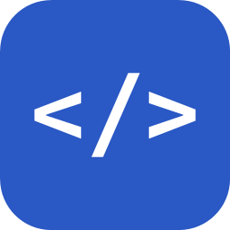
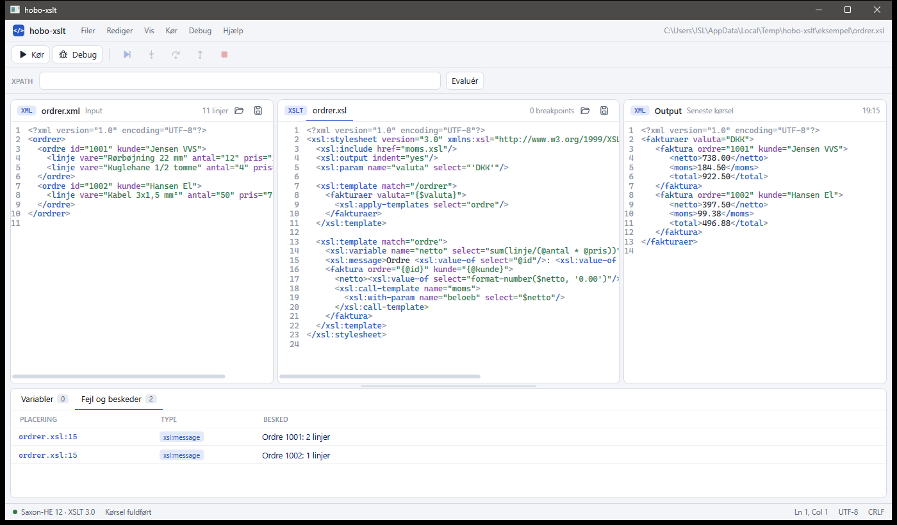
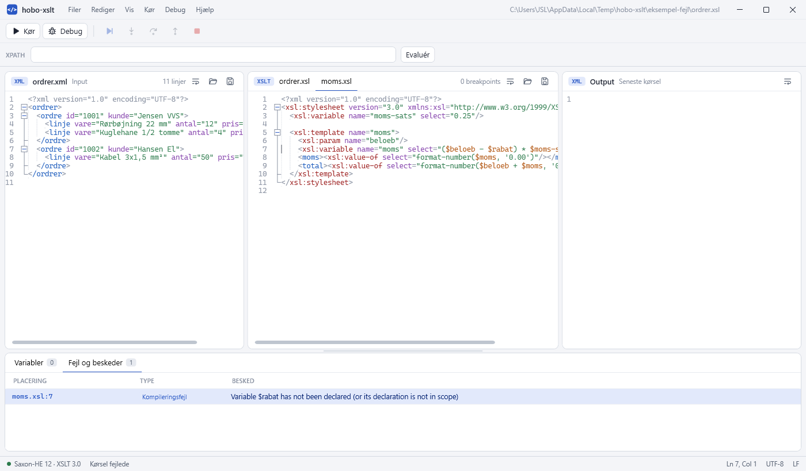
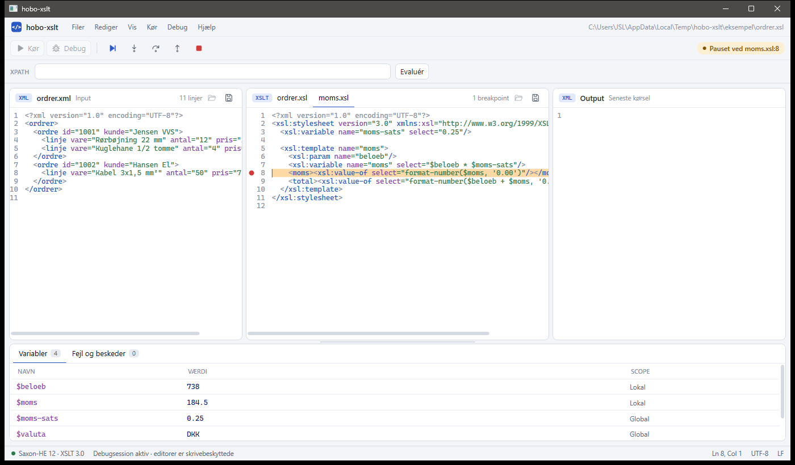
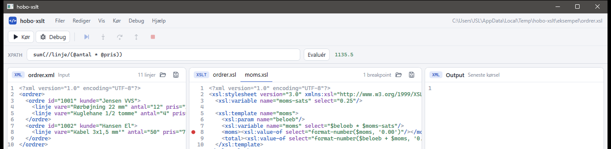

<p align="center">
  
</p>

<h1 align="center">hobo-xslt</h1>

<p align="center">
  Et program til Windows, hvor du skriver, kører og debugger XSLT med Saxon – lidt i stil med XmlSpy.
</p>

hobo-xslt samler det, du skal bruge, når et XSLT-stylesheet ikke gør, som du forventer: XML-input, stylesheet og resultat side om side, en liste med fejl og beskeder, en debugger, der kan stoppe på en linje og vise variablerne, og et felt til at prøve XPath-udtryk af på dit input. Under motorhjelmen kører Saxon-HE 12 med XSLT 3.0.

## Det får du

- **Tre ruder side om side** – XML-input til venstre, XSLT i midten og resultatet til højre. Alle tre har farver på XML, linjenumre og trækbare skillelinjer.
- **Kør med ét klik** – **Kør** transformerer dit XML med dit XSLT og viser resultatet som XML i **Output**.
- **Fejl og beskeder** – fejl i stylesheetet, fejl under kørslen og `xsl:message` står i en liste med fil og linje. Dobbeltklik, så står du på linjen.
- **Include og import** – en fejl eller en pause i en fil, som dit stylesheet inkluderer, åbner filen i en ekstra fane.
- **Debugger** – sæt breakpoints, gå trin for trin, fortsæt eller stop. Linjen, debuggeren står på, er orange.
- **Variabler** – mens debuggeren holder pause, ser du de lokale variabler og de globale variabler og parametre med deres værdier.
- **XPath** – prøv et XPath-udtryk af på dit XML og se resultatet med det samme.
- **Dansk eller engelsk** – vælg sprog under **Vis → Sprog**.
- **Én exe-fil** – `install.ps1` laver én exe og lægger en genvej i Start-menuen.
- **Licenser** – **Hjælp → Licenser…** viser de komponenter, programmet bruger, med version, licens og link til projektet.



## Kom hurtigt i gang

### Krav

- Windows. Programmet bruger WPF.
- [.NET 10 SDK](https://dotnet.microsoft.com/en-us/download/dotnet/10.0) til at bygge, teste og køre fra kildekoden og til `install.ps1`.

Den færdige exe har .NET med indbygget, så den kræver ikke, at .NET er installeret.

### Kør fra kildekoden

Kør fra mappen med `HoboXslt.slnx`:

```powershell
dotnet run --project .\src\HoboXslt.App
```

### Installer i Start-menuen

```powershell
.\install.ps1
```

Scriptet

1. venter, hvis hobo-xslt allerede kører fra `publish\`, og beder dig lukke det og trykke Enter. Ugemte ændringer findes kun i det åbne program, så scriptet lukker det ikke selv.
2. bygger programmet til `publish\HoboXslt.App.exe`.
3. opretter genvejen **hobo-xslt** i Start-menuen.
4. starter programmet.

Fejler bygningen, stopper scriptet med beskeden `Publish af hobo-xslt fejlede.`, og genvejen bliver ikke rørt.

`HoboXslt.App.exe` er én fil på ca. 257 MB, og den virker alene, også hvis du kopierer den til en anden mappe. Ved siden af den ligger tre `.pdb`-filer, som programmet ikke skal bruge.

**Første start tager lidt længere tid.** Saxon kører gennem IKVM, som har brug for rigtige filer på disken. Første gang en ny udgave af exe-filen starter, pakker den derfor ca. 250 MB filer ud i `%TEMP%\.net\HoboXslt.App\` i en undermappe med et tilfældigt navn. Næste gang bruger den mappen igen. Hver ny udgave får sin egen mappe, så gamle mapper derinde kan slettes, når programmet er lukket.

Mens Saxon starter, står der **Starter Saxon…** nederst, og **Kør** og **Debug** er grå. Når der står **Klar**, kan du gå i gang.

## Sådan kører du en transformation

1. **Åbn XML-input** med mappe-knappen i ruden **XML** eller **Filer → Åbn XML…**.
2. **Åbn stylesheetet** med mappe-knappen i ruden **XSLT** eller **Filer → Åbn XSLT…**. Stien til den fil, der bliver kørt, står øverst til højre i vinduet.
3. **Tryk Kør** (eller **Kør → Kør**).
4. **Læs resultatet** i **Output**. Output og beskeder kommer frem, mens kørslen er i gang. Klokkeslættet for kørslen står i rudens overskrift. Er resultatet ikke gyldigt XML, vises det som almindelig tekst, når kørslen er færdig. `xsl:message` står under **Fejl og beskeder**.

Fejler kørslen, bliver det output, der allerede er skrevet, stående i **Output**, og der står **Kørsel fejlede** nederst (med **output er ufuldstændigt**, hvis der er skrevet noget). Fejlen står under **Fejl og beskeder**.

**Stop en kørsel** med stop-knappen (■) eller Shift+F5, fx hvis stylesheetet er gået i en uendelig løkke. Kørslen stopper med det samme, også midt i ét enkelt XPath-udtryk. Det output og de beskeder, der allerede er skrevet, bliver stående, der står **Kørsel stoppet** nederst (med **output er ufuldstændigt**, hvis der er skrevet noget), og du kan starte en ny kørsel med det samme.

I rudernes overskrift står filnavnet, og et `*` efter navnet betyder, at filen er ændret og ikke gemt. **XML** viser antallet af linjer, og **XSLT** antallet af breakpoints i den valgte fane. Nederst står Saxons version, hvad programmet laver lige nu, markørens linje og kolonne, tegnsæt og linjeskift.

### Det skal du vide om at gemme

- **Kør** og **Debug** bruger filerne på disken. Har du rettet i XML eller XSLT, gemmes filerne først, uden at du bliver spurgt.
- En fil, der aldrig er gemt (der står **ikke gemt**), kan ikke køres. Gem den først med gem-knappen i ruden.
- Åbner du en anden fil i stedet for en, du har rettet i, beder programmet dig gemme først. **OK** gemmer og åbner den nye fil, **Annuller** lader alt være. Du kan ikke smide ændringerne væk.
- **Output** skal aldrig gemmes.
- Gem-knappen i ruden **XSLT** og **Filer → Gem XSLT** gemmer filen i den valgte fane.
- `Ctrl+S` gemmer filen i den rude, du står i: **XML** eller den valgte fane i **XSLT**. Står du et andet sted, fx i **Output**, gemmes den af de to, du sidst stod i.

## Fejl og beskeder

Fanen **Fejl og beskeder** nederst viser én linje for hver fejl eller besked med **PLACERING** (fil og linje), **TYPE** og **BESKED**. Typen er **Kompileringsfejl**, **Kørselsfejl** eller **xsl:message**. Saxons egne fejltekster vises, som Saxon skriver dem, altså på engelsk.

**Dobbeltklik på en linje** for at hoppe til fejlen. Ligger fejlen i en fil, som stylesheetet inkluderer eller importerer, åbner filen i en ny fane i ruden **XSLT**, eller fanen vælges, hvis den allerede er åben. En fejl i XML-filen viser linjen i ruden **XML**. En linje uden fil og linjenummer kan ikke åbnes.



Den første fane i **XSLT** er altid den fil, der bliver kørt. Ekstra faner kommer aldrig i stedet for den.

## Sådan debugger du

1. **Sæt et breakpoint** ved at klikke i den smalle kant til venstre for linjenumrene. Der kommer en rød prik, og et nyt klik fjerner den. Det virker i alle faner, også i inkluderede filer.
2. **Start debuggeren** med **Debug** eller F5.
3. **Debuggeren holder pause** før den første instruktion på linjen. Filen åbnes, også hvis den er inkluderet, markøren står på linjen, linjen bliver orange, og øverst til højre står fx **Pauset ved moms.xsl:8**.
4. **Gå videre** med knapperne i værktøjslinjen eller tasterne:

   | Knap | Tast | Hvad sker der |
   |---|---|---|
   | **Fortsæt** | F5 | Kører videre til næste breakpoint eller til slutningen |
   | **Step into** | F11 | Holder pause ved den næste instruktion, også inde i en template, der bliver kaldt |
   | **Step over** | F10 | Holder pause ved den næste instruktion på samme niveau og springer det over, der ligger inden i |
   | **Step out** | Shift+F11 | Kører resten af det nuværende niveau og holder pause ved den næste instruktion udenfor |
   | **Stop** | Shift+F5 | Stopper kørslen |

   Den orange linje flytter med for hvert trin, så du kan se, hvor du er. Den forsvinder, når kørslen stopper, bliver færdig eller fejler.

5. **Når kørslen er færdig**, står resultatet i **Output** og beskederne under **Fejl og beskeder**, og der står **Debugsession fuldført** nederst. Output og beskeder kommer frem undervejs, også mens debuggeren holder pause. Trykker du **Stop**, bliver det, der allerede er skrevet, stående, og der står **Debugsession stoppet** (med **output er ufuldstændigt**, hvis der er skrevet noget).



### Variabler

Mens debuggeren holder pause, viser fanen **Variabler** de variabler og parametre, der gælder lige nu, med **NAVN**, **VÆRDI** og **SCOPE**. Først kommer de lokale (**Lokal**), derefter de globale variabler og parametre (**Global**) efter navn. En global variabel, som Saxon ikke har regnet ud endnu, og en værdi, der ikke kan vises, står som **utilgængelig**. Debuggeren kører videre som normalt.

### Godt at vide

- Mens debuggeren kører, kan du ikke rette i filerne eller ændre breakpoints, og **Kør**, **Debug** og knapperne til at åbne filer er grå.
- Står et breakpoint på en linje uden en instruktion, fx en lukkende tag, bliver det aldrig ramt. Når en debugkørsel er færdig, vises sådan et breakpoint som en tom ring.
- Et breakpoint holder pause én gang, hver gang kørslen kommer til linjen, også hvis linjen har flere instruktioner.
- Breakpoints bliver ikke gemt, når du lukker programmet.
- Lukker du programmet under en debugkørsel, stoppes kørslen.

## XPath

Skriv et udtryk i feltet **XPATH**, og tryk **Evaluér** eller Enter (eller **Kør → Evaluér XPath**). Udtrykket bliver regnet ud på teksten i ruden **XML**, også hvis den ikke er gemt, og resultatet står til højre for knappen.

- Flere resultater står på hver sin linje, og en attribut står som `navn="værdi"`.
- Et tomt resultat står som **Tom sekvens**.
- Et forkert udtryk giver Saxons fejltekst med rødt, fx `Unexpected token "<eof>" at start of expression`.



### Namespaces

Prefikser, som er erklæret på XML-filens rodelement, kan bruges direkte i udtrykket. Et standard-namespace (`xmlns="..."` uden prefiks) har intet prefiks at bruge, så med `<ordrer xmlns="urn:eksempel:ordrer">` finder `//ordre` ingenting. Brug i stedet `*:` eller det fulde navn:

```text
//*:ordre/@kunde
count(//Q{urn:eksempel:ordrer}ordre)
```

## Sprog

Vælg **Dansk** eller **English** under **Vis → Sprog**. Alle tekster skifter med det samme, og valget huskes til næste gang i `%LOCALAPPDATA%\hobo-xslt\settings.json`. Dansk er standard, også hvis filen mangler eller ikke kan læses. Saxons egne fejltekster er altid på engelsk.

Teksterne ligger i `src/HoboXslt.Core/Languages/Dansk.json` og `English.json` og er bygget ind i programmet. Mangler en tekst i den engelske fil, bruges den danske.

## Tastaturgenveje

| Genvej | Handling |
|---|---|
| `Ctrl+S` | Gem filen i **XML** eller den valgte fane i **XSLT**, alt efter hvor du står |
| `F5` | Start debuggeren, eller fortsæt, når den holder pause |
| `Shift+F5` | Stop kørslen eller debuggeren |
| `F10` | Step over |
| `F11` | Step into |
| `Shift+F11` | Step out |
| `Enter` | Evaluér udtrykket, når du står i feltet **XPATH** |

**Kør** har ingen genvej.

## Det kan programmet ikke

- Saxon-HE kan ikke streaming eller schema-aware XSLT. Det kræver en betalt udgave af Saxon.
- Ekstra resultater fra `xsl:result-document` vises ikke.
- Der er intet sted at give stylesheetets parametre en værdi. De bruger deres standardværdi.
- Kun én kørsel ad gangen.
- Kun Windows og kun lyst tema. Menuen **Rediger** er tom.

## Projektet

```text
hobo-xslt/
├─ src/HoboXslt.App/            WPF-programmet: vindue, editorer, breakpoints og visning af debuggeren
├─ src/HoboXslt.Core/           Saxon, kørsel, debugger, XPath, sprogfiler og indstillinger, uden WPF
├─ tests/HoboXslt.Core.Tests/   xUnit-tests af HoboXslt.Core
├─ docs/images/                 Billeder til denne README
├─ docs/design/                 Designet af hovedvinduet (main-window-mockup.html)
├─ install.ps1                  Bygger exe-filen, laver genvejen i Start-menuen og starter programmet
└─ HoboXslt.slnx                Solution
```

Programmet bruger .NET 10, WPF, AvalonEdit som editor og Saxon-HE 12 gennem IKVM. Al logik ligger i `HoboXslt.Core`, så den kan testes uden vinduer. WPF-delen viser bare tilstanden og sender kommandoer. Debuggeren bruger Saxons trace: hver instruktion melder sig, før den kører, og kørslen venter, når den skal holde pause. Saxon-HE kan ikke afbrydes midt i en transformation, så hver kørsel og debugkørsel sker i sin egen proces (exe-filen startet med `--worker`), og **Stop** lukker den proces. For at spare ventetid starter programmet altid den næste proces på forhånd, så du ser to `HoboXslt.App.exe` i Jobliste, mens programmet er åbent. Den ekstra proces lukker sammen med vinduet.

### Build og test

```powershell
dotnet build HoboXslt.slnx
dotnet test tests/HoboXslt.Core.Tests
```

Testene dækker kørsel, fejl med fil og linje, debuggeren (breakpoints, trin, stop og variabler), XPath, sprogfilerne og at **Stop** stopper en uendelig løkke i både **Kør** og **Debug**. WPF-delen har ingen automatiske tests.
